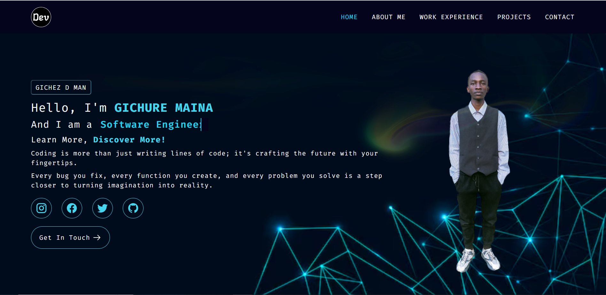
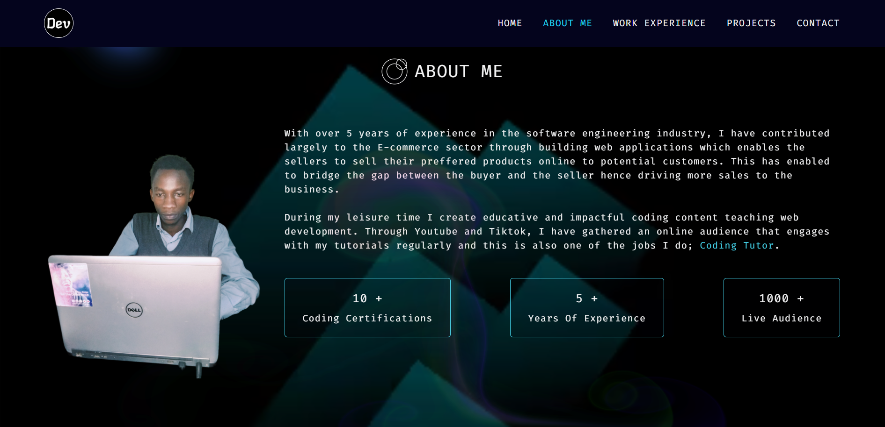

## MY SOFTWARE ENGINEERING PORTFOLIO
- This portfolio contains all my professional achievements and showcases my career progression as a Software Engineer.
- Built using React.js library and Tailwind CSS technologies for a more clean, professional, and modern portfolio design system. 

## LIVE DEMO 
Link: https://gichuremaina.netlify.app

## FEATURES
- AOS library for different CSS animation effects. 
- Clean, professional, and modern UI/UX portfolio design system.
- Reactbits dev library for modern UI components and animations eg Splash Cursor animation.
- Smooth scroll navigation to different sections ie Home, About, Experience, and Contact Sections.
- Tailwind CSS utility classes for clean, faster, and modern CSS styling.
- React.js custom hooks ie useState() and useEffect() hooks for setting different states and use cases.
- Re-usable React.js components for faster and efficient modern website development.

## TECH STACK
### Frontend Development: 
- React.js. 
- Tailwind CSS. 
- HTML. 
- Custom CSS.
### Backend Development: 
- Node.js. 
- Express.
### Database Storage: 
- MongoDB.
### Software Deployment:
- Netlify.

## Future Improvements
- Add new projects section.
- Include technical skills in the projects section.
- Integrate smart AI solutions for collecting data analysis and analyzing website traffic ie No of portfolio visits per day, No of Active links clicked, Average Retention Rate Per User.
- Improve Website Accessibility and Perfomance.
